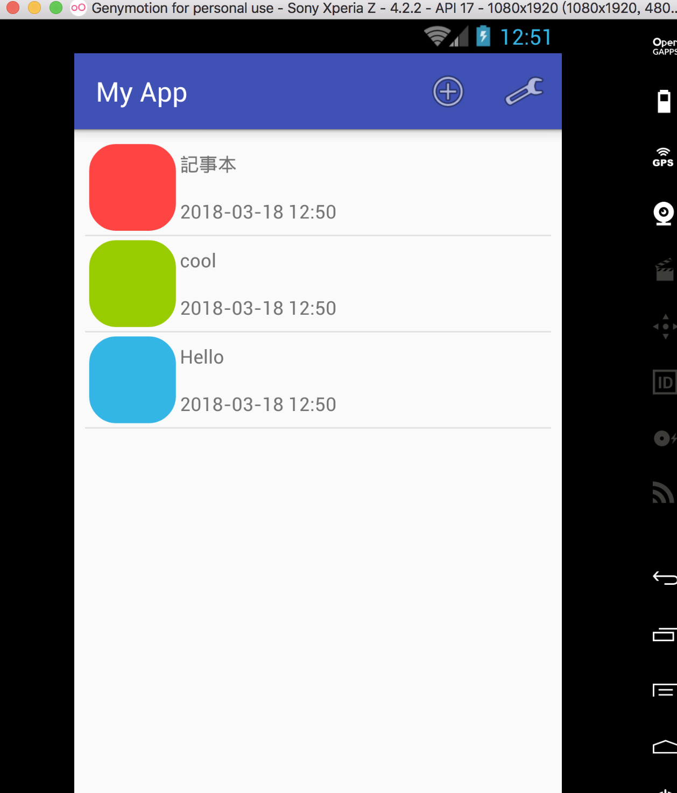
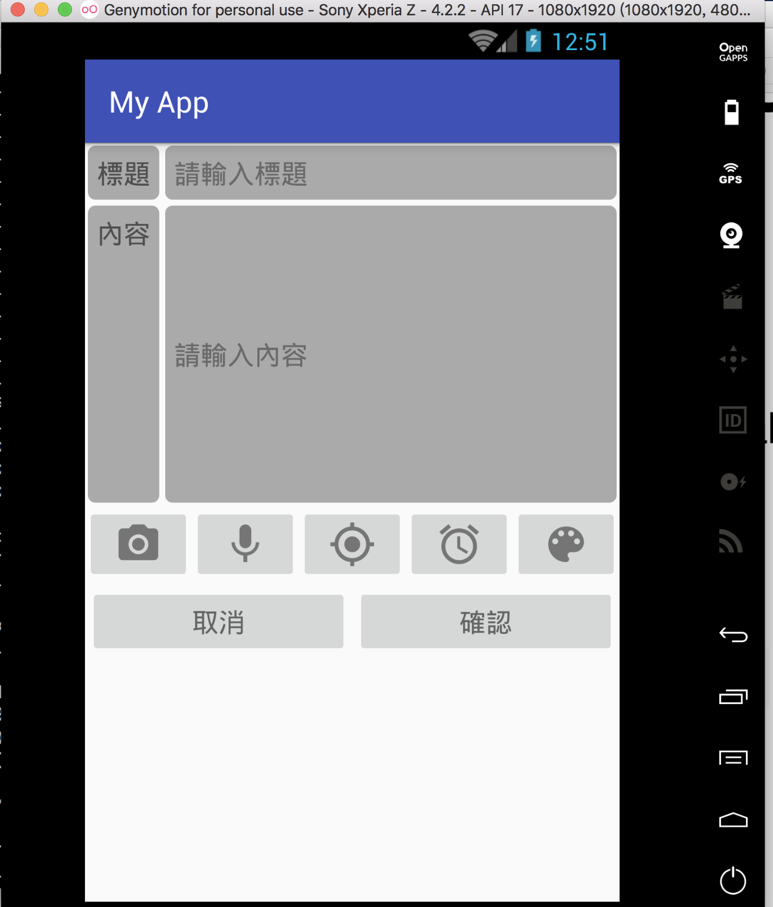
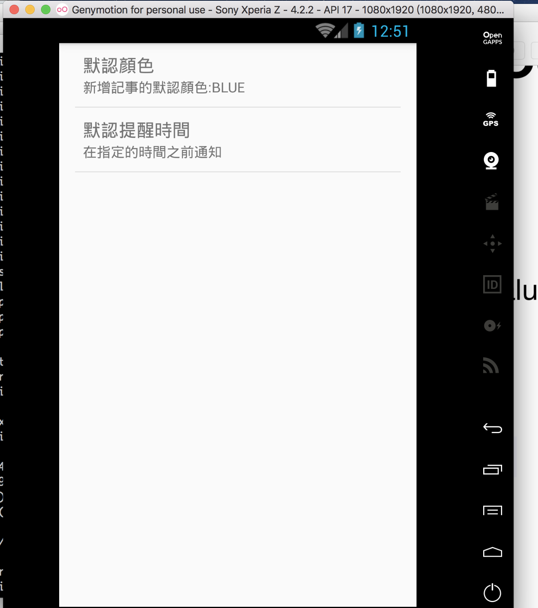

## TodoList on the Android

{:height="50%" width="50%"}
 We can use the add icon on the actionbar to add the TODO
 Also, we can edit the TODO with the click interaction

 We can key in the title, content and choose the color for the TODO
 The time will be saved automatically.

 We can change the setting through the setting icon in the mainscene

